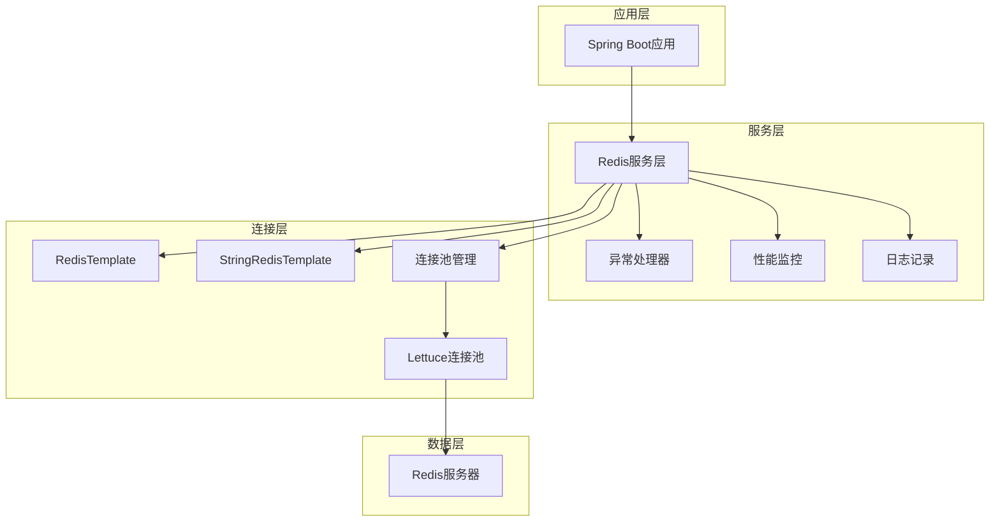

# Redis技术架构文档

## 1. 架构设计



## 2. 技术描述

* 框架：Spring Boot 3.5.0 + Spring Data Redis

* 连接客户端：Lettuce（默认）

* 连接池：Apache Commons Pool2

* Java版本：Java 21

* 序列化：Jackson JSON

## 3. 核心组件设计

### 3.1 Redis配置类

**RedisConfig.java**

```java
@Configuration
@EnableCaching
@Slf4j
public class RedisConfig {
    
    @Bean
    public RedisTemplate<String, Object> redisTemplate(RedisConnectionFactory connectionFactory) {
        RedisTemplate<String, Object> template = new RedisTemplate<>();
        template.setConnectionFactory(connectionFactory);
        
        // 设置序列化器
        Jackson2JsonRedisSerializer<Object> serializer = new Jackson2JsonRedisSerializer<>(Object.class);
        ObjectMapper mapper = new ObjectMapper();
        mapper.setVisibility(PropertyAccessor.ALL, JsonAutoDetect.Visibility.ANY);
        mapper.activateDefaultTyping(LazyPropertyFilter.getDefaultTyper(), ObjectMapper.DefaultTyping.NON_FINAL);
        serializer.setObjectMapper(mapper);
        
        template.setKeySerializer(new StringRedisSerializer());
        template.setValueSerializer(serializer);
        template.setHashKeySerializer(new StringRedisSerializer());
        template.setHashValueSerializer(serializer);
        
        template.afterPropertiesSet();
        return template;
    }
    
    @Bean
    public StringRedisTemplate stringRedisTemplate(RedisConnectionFactory connectionFactory) {
        return new StringRedisTemplate(connectionFactory);
    }
}
```

### 3.2 Redis服务接口

**RedisService.java**

```java
public interface RedisService {
    
    // 基础操作
    void set(String key, Object value);
    void set(String key, Object value, long timeout, TimeUnit unit);
    Object get(String key);
    Boolean delete(String key);
    Long delete(Collection<String> keys);
    Boolean hasKey(String key);
    Boolean expire(String key, long timeout, TimeUnit unit);
    Long getExpire(String key);
    
    // 批量操作
    void multiSet(Map<String, Object> map);
    List<Object> multiGet(Collection<String> keys);
    
    // 字符串操作
    Long increment(String key);
    Long increment(String key, long delta);
    Double increment(String key, double delta);
    Long decrement(String key);
    Long decrement(String key, long delta);
    
    // 哈希操作
    void hSet(String key, String hashKey, Object value);
    Object hGet(String key, String hashKey);
    Map<Object, Object> hGetAll(String key);
    void hMultiSet(String key, Map<String, Object> map);
    List<Object> hMultiGet(String key, Collection<Object> hashKeys);
    Boolean hHasKey(String key, String hashKey);
    Long hDelete(String key, Object... hashKeys);
    Long hSize(String key);
    
    // 列表操作
    Long lPush(String key, Object... values);
    Long rPush(String key, Object... values);
    Object lPop(String key);
    Object rPop(String key);
    List<Object> lRange(String key, long start, long end);
    Long lSize(String key);
    
    // 集合操作
    Long sAdd(String key, Object... values);
    Set<Object> sMembers(String key);
    Boolean sIsMember(String key, Object value);
    Long sSize(String key);
    Long sRemove(String key, Object... values);
    
    // 有序集合操作
    Boolean zAdd(String key, Object value, double score);
    Long zAdd(String key, Set<ZSetOperations.TypedTuple<Object>> tuples);
    Set<Object> zRange(String key, long start, long end);
    Set<Object> zRangeByScore(String key, double min, double max);
    Long zRemove(String key, Object... values);
    Long zSize(String key);
}
```

### 3.3 Redis服务实现类

**RedisServiceImpl.java**

```java
@Service
@Slf4j
public class RedisServiceImpl implements RedisService {
    
    @Autowired
    private RedisTemplate<String, Object> redisTemplate;
    
    @Autowired
    private StringRedisTemplate stringRedisTemplate;
    
    @Autowired
    private RedisPerformanceMonitor performanceMonitor;
    
    @Override
    public void set(String key, Object value) {
        try {
            long startTime = System.currentTimeMillis();
            redisTemplate.opsForValue().set(key, value);
            performanceMonitor.recordOperation("SET", System.currentTimeMillis() - startTime);
            log.debug("Redis SET操作成功: key={}", key);
        } catch (Exception e) {
            log.error("Redis SET操作失败: key={}", key, e);
            throw new RedisOperationException("SET操作失败", e);
        }
    }
    
    @Override
    public void set(String key, Object value, long timeout, TimeUnit unit) {
        try {
            long startTime = System.currentTimeMillis();
            redisTemplate.opsForValue().set(key, value, timeout, unit);
            performanceMonitor.recordOperation("SETEX", System.currentTimeMillis() - startTime);
            log.debug("Redis SETEX操作成功: key={}, timeout={} {}", key, timeout, unit);
        } catch (Exception e) {
            log.error("Redis SETEX操作失败: key={}", key, e);
            throw new RedisOperationException("SETEX操作失败", e);
        }
    }
    
    @Override
    public Object get(String key) {
        try {
            long startTime = System.currentTimeMillis();
            Object result = redisTemplate.opsForValue().get(key);
            performanceMonitor.recordOperation("GET", System.currentTimeMillis() - startTime);
            log.debug("Redis GET操作成功: key={}", key);
            return result;
        } catch (Exception e) {
            log.error("Redis GET操作失败: key={}", key, e);
            throw new RedisOperationException("GET操作失败", e);
        }
    }
    
    // 其他方法实现...
}
```

### 3.4 异常处理

**RedisOperationException.java**

```java
public class RedisOperationException extends RuntimeException {
    public RedisOperationException(String message) {
        super(message);
    }
    
    public RedisOperationException(String message, Throwable cause) {
        super(message, cause);
    }
}
```

**RedisExceptionHandler.java**

```java
@Component
@Slf4j
public class RedisExceptionHandler {
    
    @EventListener
    public void handleRedisConnectionFailure(RedisConnectionFailureException e) {
        log.error("Redis连接失败，尝试重连: {}", e.getMessage());
        // 实现重连逻辑
    }
    
    @Retryable(value = {RedisConnectionFailureException.class}, 
               maxAttempts = 3, 
               backoff = @Backoff(delay = 1000))
    public Object executeWithRetry(Supplier<Object> operation) {
        return operation.get();
    }
}
```

### 3.5 性能监控

**RedisPerformanceMonitor.java**

```java
@Component
@Slf4j
public class RedisPerformanceMonitor {
    
    private final MeterRegistry meterRegistry;
    private final Map<String, Timer> operationTimers = new ConcurrentHashMap<>();
    private final AtomicLong totalOperations = new AtomicLong(0);
    private final AtomicLong failedOperations = new AtomicLong(0);
    
    public RedisPerformanceMonitor(MeterRegistry meterRegistry) {
        this.meterRegistry = meterRegistry;
    }
    
    public void recordOperation(String operation, long executionTime) {
        totalOperations.incrementAndGet();
        
        Timer timer = operationTimers.computeIfAbsent(operation, 
            op -> Timer.builder("redis.operation.duration")
                      .tag("operation", op)
                      .register(meterRegistry));
        
        timer.record(executionTime, TimeUnit.MILLISECONDS);
        
        if (executionTime > 1000) { // 超过1秒记录慢查询
            log.warn("Redis慢查询检测: operation={}, duration={}ms", operation, executionTime);
        }
    }
    
    public void recordFailure(String operation) {
        failedOperations.incrementAndGet();
        Counter.builder("redis.operation.failures")
               .tag("operation", operation)
               .register(meterRegistry)
               .increment();
    }
    
    @Scheduled(fixedRate = 60000) // 每分钟输出统计信息
    public void logStatistics() {
        long total = totalOperations.get();
        long failed = failedOperations.get();
        double successRate = total > 0 ? (double)(total - failed) / total * 100 : 0;
        
        log.info("Redis操作统计 - 总操作数: {}, 失败数: {}, 成功率: {:.2f}%", 
                total, failed, successRate);
    }
}
```

### 3.6 连接池配置

**application.yml配置优化**

```yaml
spring:
  data:
    redis:
      database: 1
      host: 115.190.96.40
      port: 6379
      timeout: 5000ms
      password: W6!jF&k2#pL@
      lettuce:
        pool:
          max-active: 16        # 连接池最大连接数
          max-idle: 8           # 连接池最大空闲连接数
          min-idle: 2           # 连接池最小空闲连接数
          max-wait: 3000ms      # 连接池最大阻塞等待时间
        shutdown-timeout: 100ms
        cluster:
          refresh:
            adaptive: true      # 自适应集群拓扑刷新
            period: 30s         # 集群拓扑刷新周期
```

## 4. 使用示例

### 4.1 基础使用

```java
@Service
public class UserCacheService {
    
    @Autowired
    private RedisService redisService;
    
    private static final String USER_CACHE_PREFIX = "user:";
    private static final long CACHE_EXPIRE_TIME = 3600; // 1小时
    
    public void cacheUser(User user) {
        String key = USER_CACHE_PREFIX + user.getId();
        redisService.set(key, user, CACHE_EXPIRE_TIME, TimeUnit.SECONDS);
    }
    
    public User getUser(Long userId) {
        String key = USER_CACHE_PREFIX + userId;
        return (User) redisService.get(key);
    }
    
    public void removeUser(Long userId) {
        String key = USER_CACHE_PREFIX + userId;
        redisService.delete(key);
    }
}
```

### 4.2 分布式锁实现

```java
@Component
public class RedisDistributedLock {
    
    @Autowired
    private StringRedisTemplate stringRedisTemplate;
    
    private static final String LOCK_PREFIX = "lock:";
    private static final String LOCK_VALUE = "locked";
    
    public boolean tryLock(String lockKey, long expireTime, TimeUnit timeUnit) {
        String key = LOCK_PREFIX + lockKey;
        Boolean result = stringRedisTemplate.opsForValue()
            .setIfAbsent(key, LOCK_VALUE, expireTime, timeUnit);
        return Boolean.TRUE.equals(result);
    }
    
    public void unlock(String lockKey) {
        String key = LOCK_PREFIX + lockKey;
        stringRedisTemplate.delete(key);
    }
}
```

## 5. 监控和运维

### 5.1 健康检查

```java
@Component
public class RedisHealthIndicator implements HealthIndicator {
    
    @Autowired
    private StringRedisTemplate stringRedisTemplate;
    
    @Override
    public Health health() {
        try {
            String result = stringRedisTemplate.execute((RedisCallback<String>) connection -> {
                return connection.ping();
            });
            
            if ("PONG".equals(result)) {
                return Health.up()
                    .withDetail("redis", "Available")
                    .withDetail("database", stringRedisTemplate.getConnectionFactory().getConnection().getNativeConnection())
                    .build();
            }
        } catch (Exception e) {
            return Health.down()
                .withDetail("redis", "Unavailable")
                .withException(e)
                .build();
        }
        
        return Health.down().withDetail("redis", "Unknown").build();
    }
}
```

### 5.2 性能指标

* 连接池使用率监控

* 操作响应时间统计

* 慢查询日志记录

* 错误率统计

* 内存使用情况

## 6. 最佳实践

1. **键命名规范**：使用有意义的前缀，如 `user:profile:123`
2. **过期时间设置**：避免数据永久存储，合理设置TTL
3. **序列化选择**：根据数据类型选择合适的序列化方式
4. **连接池调优**：根据业务负载调整连接池参数
5. **异常处理**：实现重试机制和降级策略
6. **监控告警**：设置关键指标的监控和告警
7. **数据一致性**：注意缓存与数据库的一致性问题

## 7. 部署注意事项

1. Redis服务器配置优化
2. 网络延迟考虑
3. 内存使用监控
4. 备份和恢复策略
5. 集群模式配置（如需要）
6. 安全配置（密码、网络访问控制）

